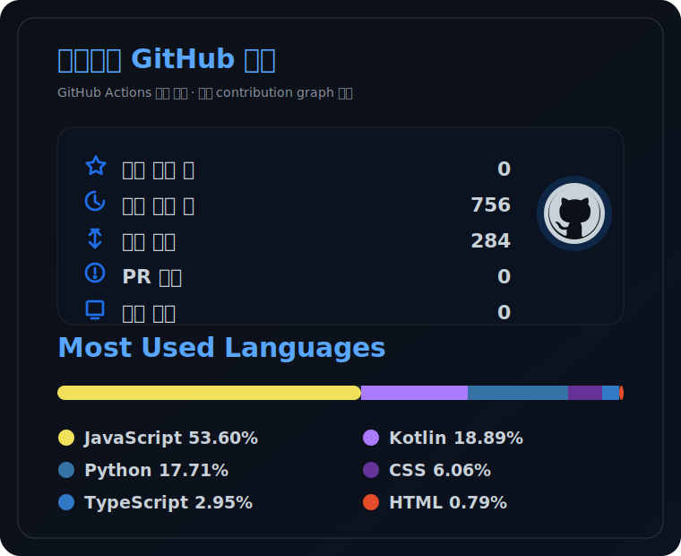

```text
██╗  ██╗███████╗██╗     ██╗      ██████╗
██║  ██║██╔════╝██║     ██║     ██╔═══██╗
███████║█████╗  ██║     ██║     ██║   ██║
██╔══██║██╔══╝  ██║     ██║     ██║   ██║
██║  ██║███████╗███████╗███████╗╚██████╔╝
╚═╝  ╚═╝╚══════╝╚══════╝╚══════╝ ╚═════╝
```

# Hello, I'm 이선우

Backend · AI Search · RAG · LLM Serving

[](mailto:sunwoomjc@widiservice.com)
[](https://github.com/sunwoo8478)
[](https://github.com/sunwoo8478)

---

## About Me

백엔드와 AI 검색 시스템을 다룹니다.  
요즘은 상담 도메인의 질문을 RAG 파이프라인으로 연결하고, GPU 서버에서 LLM 응답을 안정적으로 서빙하는 일을 하고 있습니다.

| Now | Details |
| --- | --- |
| Main work | 서울노동권익센터 AI 상담 챗봇 |
| Focus | RAG 품질 개선, vLLM 서빙, 부하 테스트 |
| Backend | Spring Boot, FastAPI |
| Infra | Docker, GitHub Actions, Linux, KT Cloud GPU |

## Connect with Me

| GitHub | Email | Work |
| --- | --- | --- |
| [](https://github.com/sunwoo8478) | [](mailto:sunwoomjc@widiservice.com) |  |

## Projects

### 서울노동권익센터 AI 노무상담 챗봇

비공개 프로젝트입니다. 노동 상담 데이터를 기반으로 답변 근거를 찾고, 필요한 경우 상담 연계까지 이어지는 흐름을 만들고 있습니다.


- Gemma 3 12B, bge-m3, BGE-Reranker
- A100 80GB GPU 서버에서 vLLM 서빙 및 부하 테스트
- SSE 스트리밍, 시맨틱 캐시, 상담 연계 흐름

### [한국어 지식 기반 RAG 어시스턴트](https://github.com/sunwoo8478/korean-chatbot)

한국어 공공데이터 문서를 검색하고 답변 근거를 함께 보여주는 RAG 서비스입니다.

[](https://github.com/sunwoo8478/korean-chatbot/actions/workflows/ci.yml)
[](https://github.com/sunwoo8478/korean-chatbot/commits/main)
[](https://github.com/sunwoo8478/korean-chatbot)


### [PayFit ERP](https://github.com/sunwoo8478/ERP)

근태, 급여 계산, 법정 공제, 명세서 발급 흐름을 하나로 묶은 HR 시스템입니다.

[](https://github.com/sunwoo8478/ERP/actions/workflows/ci.yml)
[](https://github.com/sunwoo8478/ERP/commits/main)
[](https://github.com/sunwoo8478/ERP)


## Tech Stack

<div align="center">


<br>


</div>

## Git Stats

<div align="center">




### Contribution Graph

<picture>
  <source media="(prefers-color-scheme: dark)" srcset="https://raw.githubusercontent.com/sunwoo8478/sunwoo8478/output/snake-dark.svg">
  <source media="(prefers-color-scheme: light)" srcset="https://raw.githubusercontent.com/sunwoo8478/sunwoo8478/output/snake.svg">
  
</picture>

</div>

## Notes

| Topic | Focus |
| --- | --- |
| API | 요청과 응답이 명확한 구조 |
| Search | 실패 케이스를 수집하고 개선할 수 있는 검색 흐름 |
| LLM Serving | TTFT, 처리량, 동시 요청 수를 실제로 측정하는 운영 |
| Data | 인덱스, 트랜잭션, 마이그레이션을 고려한 설계 |
| Logs | 문제가 생겼을 때 위치를 좁힐 수 있는 기록 |
