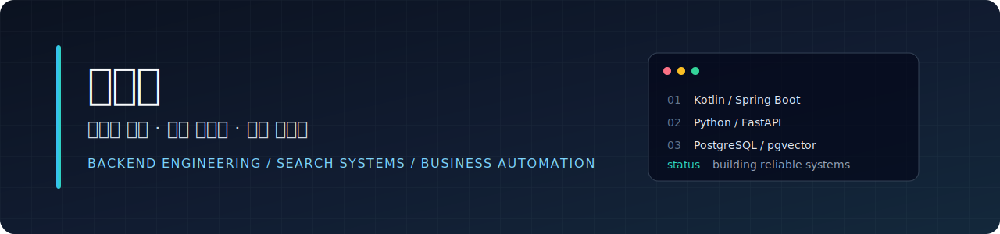

# 이선우 | 백엔드 · AI 개발자

백엔드 시스템과 AI 검색 기반 서비스를 개발합니다. 
RAG 파이프라인 · Spring Boot · Python/FastAPI · LLM 서빙 전문

### 연락처

---

## 현재 집중하는 일

- **서울노동권익센터 AI 챗봇** 개발 및 KT Cloud A100 서버 부하 테스트
- Gemma 3 12B (vLLM) + RAG 파이프라인 성능 최적화

---

## 개발 분야

| 분야 | 내용 |
| --- | --- |
| AI · 검색 시스템 | RAG 파이프라인, 벡터 검색, LLM 서빙 (vLLM/Ollama), 리랭킹 |
| 백엔드 | API 설계, 도메인 모델링, 인증·인가, 성능 최적화 |
| 업무 시스템 | 급여 계산, 법정 공제, 근태 및 인사 업무 자동화 |
| 인프라 | Docker, CI/CD, 부하 테스트, GPU 서버 운영 |

## 대표 프로젝트

### 서울노동권익센터 AI 노무상담 챗봇 (비공개)

서울특별시 노동자 종합지원센터에 도입할 AI 법률 상담 챗봇 서비스.

- Gemma 3 12B (vLLM) + bge-m3 임베딩 + BGE-Reranker RAG 파이프라인
- A100 80GB GPU 서버 배포, 동접자 30명 부하 테스트 (TTFT 1.7초)
- 시맨틱 캐시, 스트리밍 SSE, 노무사 연계(Handoff), 관리자 포털
- Spring Boot 3 · React 18 · MariaDB · vLLM · Ollama

---

### [한국어 지식 기반 RAG 어시스턴트](https://github.com/sunwoo8478/korean-chatbot)

한국어 공공데이터를 검색하고 근거 기반 답변을 제공하는 RAG 서비스.

---

### [PayFit ERP](https://github.com/sunwoo8478/ERP)

직원·근태·급여 계산·법정 공제·명세서 업무를 연결한 HR 시스템.

---

## 기술 스택

### 주력 스택

### AI · 검색 · 데이터

### 프론트엔드 · 인프라 · 도구

| 구분 | 사용 기술 |
| --- | --- |
| Backend | Java, Kotlin, Spring Boot, Spring Security, FastAPI |
| AI · Search | RAG, vLLM, Ollama, bge-m3, BGE-Reranker, Semantic Cache |
| Data | PostgreSQL, MariaDB, pgvector, Redis, InfluxDB |
| Frontend | React, TypeScript, Vite, Tailwind CSS |
| Infra | Docker, GitHub Actions, Linux, Grafana, KT Cloud GPU |

---

## GitHub 활동

### 기여 그래프

<picture>
  <source media="(prefers-color-scheme: dark)" srcset="https://raw.githubusercontent.com/sunwoo8478/sunwoo8478/output/snake-dark.svg">
  <source media="(prefers-color-scheme: light)" srcset="https://raw.githubusercontent.com/sunwoo8478/sunwoo8478/output/snake.svg">
  
</picture>

