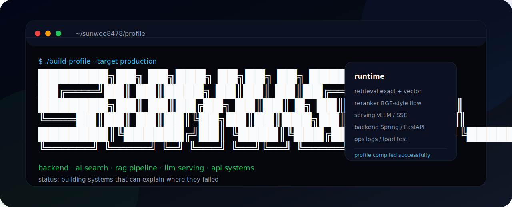
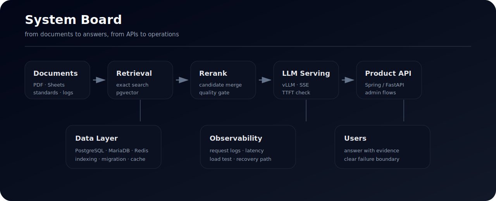
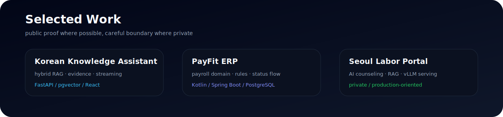

# 이선우

Backend / AI Search Engineer  
RAG pipeline, LLM serving, API design, production-minded backend

[](https://github.com/sunwoo8478)
[](mailto:sunwoomjc@widiservice.com)
[](https://github.com/sunwoo8478)

```bash
$ cat ./profile
name        Lee Sunwoo
role        Backend / AI Search
focus       retrieval quality, RAG, LLM serving, API systems
current     Seoul Labor Portal AI counseling chatbot
principle   make it work, then make the failure traceable
```

---

## What I Build

백엔드와 AI 검색 시스템을 다룹니다.  
요즘은 상담 도메인의 질문을 RAG 파이프라인으로 연결하고, GPU 서버에서 LLM 응답을 안정적으로 서빙하는 일을 하고 있습니다. 기능을 빠르게 붙이는 것보다, 나중에 문제가 생겼을 때 원인을 좁힐 수 있는 구조를 더 좋아합니다.



| Area | What I care about |
| --- | --- |
| RAG Pipeline | 문서 수집, 청킹, 정확 검색, 벡터 검색, 리랭킹, 답변 근거 연결 |
| LLM Serving | vLLM, SSE streaming, TTFT, throughput, concurrent requests |
| Backend | API 설계, 도메인 모델링, 인증/인가, 관리자 기능 |
| Data | PostgreSQL, pgvector, MariaDB, Redis, migration, indexing |
| Operation | Docker, GitHub Actions, Linux, logs, load test, recovery path |

## Selected Work



| Project | What it proves | Stack |
| --- | --- | --- |
| [Korean Knowledge Assistant](https://github.com/sunwoo8478/korean-chatbot) | 정확 검색과 벡터 검색을 함께 쓰는 한국어 RAG 서비스. 답변 근거, 리랭킹, SSE 스트리밍, 운영 콘솔까지 묶었습니다. [Architecture](https://github.com/sunwoo8478/korean-chatbot/blob/main/docs/ARCHITECTURE.md) · [Operations](https://github.com/sunwoo8478/korean-chatbot/blob/main/docs/OPERATIONS.md) | FastAPI, PostgreSQL, pgvector, React |
| [PayFit ERP](https://github.com/sunwoo8478/ERP) | 직원, 근태, 급여 계산, 공제, 승인, 명세서 흐름을 도메인 중심으로 구성한 HR·Payroll 시스템입니다. [Architecture](https://github.com/sunwoo8478/ERP/blob/master/docs/ARCHITECTURE.md) · [Payroll Rules](https://github.com/sunwoo8478/ERP/blob/master/docs/PAYROLL_RULES.md) | Kotlin, Spring Boot, PostgreSQL, React |
| 서울노동포털 AI 노무상담 챗봇 | 비공개 프로젝트입니다. 노동 상담 데이터를 기반으로 검색 근거를 찾고, 상담 연계까지 이어지는 흐름을 만들고 있습니다. | Java, Spring Boot, React, MariaDB, vLLM |

## Proof of Work

| If this breaks | I usually look at |
| --- | --- |
| 답변 근거가 약함 | exact/vector/rerank 후보, chunk 품질, query normalization |
| LLM 응답이 늦음 | TTFT, tokens/sec, reranker latency, DB query time |
| 운영 중 장애가 남 | request log, external endpoint, timeout, recovery path |
| 도메인이 복잡함 | 실행 단위, 상태 전이, 계산 결과, audit trail |
| 데이터가 커짐 | index strategy, migration plan, cache boundary |

## Engineering Notes

```text
retrieval
  ├─ exact match for terms that must not drift
  ├─ vector search for language mismatch
  ├─ reranking before context assembly
  └─ answer boundary between DB facts and model suggestions

serving
  ├─ vLLM endpoint
  ├─ SSE response stream
  ├─ TTFT / throughput check
  └─ fallback path when external services fail

backend
  ├─ clear request / response contract
  ├─ domain objects before screens
  ├─ auth and admin flows
  └─ logs that help narrow the blast radius
```

## Stack

<div align="center">


<br>


</div>

| Backend | AI / Search | Data | Frontend | Infra |
| --- | --- | --- | --- | --- |
|    |    |    |   |    |

## Repo Signals

| Repository | CI | Docs | Notes |
| --- | --- | --- | --- |
| [korean-chatbot](https://github.com/sunwoo8478/korean-chatbot) | [](https://github.com/sunwoo8478/korean-chatbot/actions/workflows/ci.yml) | [Architecture](https://github.com/sunwoo8478/korean-chatbot/blob/main/docs/ARCHITECTURE.md) · [Operations](https://github.com/sunwoo8478/korean-chatbot/blob/main/docs/OPERATIONS.md) · [Security](https://github.com/sunwoo8478/korean-chatbot/blob/main/SECURITY.md) | Hybrid RAG, SSE, admin console |
| [ERP](https://github.com/sunwoo8478/ERP) | [](https://github.com/sunwoo8478/ERP/actions/workflows/ci.yml) | [Architecture](https://github.com/sunwoo8478/ERP/blob/master/docs/ARCHITECTURE.md) · [Payroll Rules](https://github.com/sunwoo8478/ERP/blob/master/docs/PAYROLL_RULES.md) · [Security](https://github.com/sunwoo8478/ERP/blob/master/SECURITY.md) | Payroll domain, status flow, JWT |

## GitHub

<div align="center">


### Contribution Snake

<picture>
  <source media="(prefers-color-scheme: dark)" srcset="https://raw.githubusercontent.com/sunwoo8478/sunwoo8478/output/snake-dark.svg">
  <source media="(prefers-color-scheme: light)" srcset="https://raw.githubusercontent.com/sunwoo8478/sunwoo8478/output/snake.svg">
  
</picture>

</div>

## Notes

| Topic | Note |
| --- | --- |
| API | 요청과 응답이 명확한 구조를 선호합니다. |
| Search | 실패 케이스를 모으고 다시 검색 품질로 되돌리는 흐름을 중요하게 봅니다. |
| LLM Serving | “돌아간다”보다 “어디서 느린지 안다”를 더 중요하게 봅니다. |
| Data | 인덱스, 트랜잭션, 마이그레이션을 같이 생각합니다. |
| Logs | 장애가 났을 때 범위를 좁힐 수 있는 기록을 남기려 합니다. |
