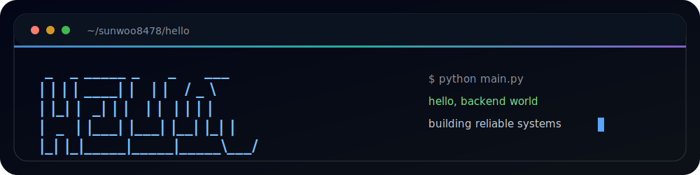
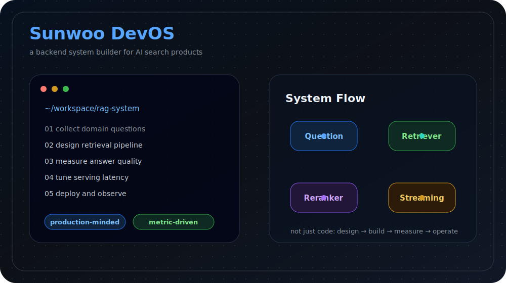
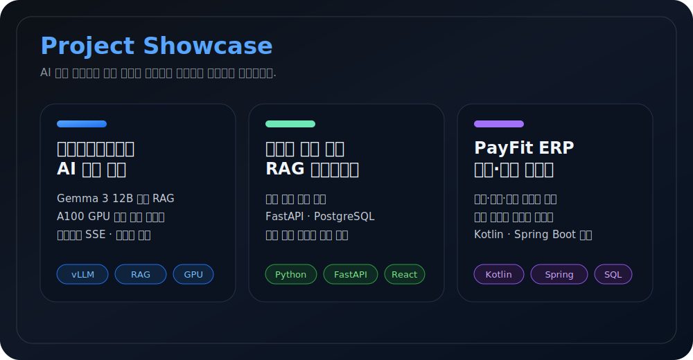
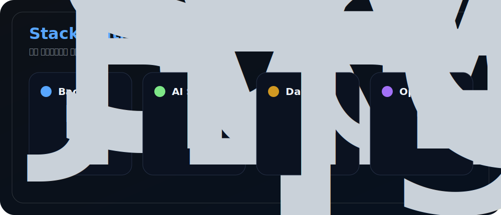

# 이선우

백엔드와 AI 검색 시스템을 만듭니다.

RAG Pipeline · LLM Serving · Spring Boot · FastAPI · GPU Ops

---

## About

사용자의 질문이 실제 업무에서 어떻게 쓰이는지 먼저 보고, 그 흐름에 맞춰 백엔드와 검색 시스템을 설계합니다.

- 서울노동권익센터 AI 상담 챗봇 개발
- Gemma 3 12B 기반 RAG 파이프라인 최적화
- A100 GPU 서버에서 vLLM 서빙 및 부하 테스트
- Spring Boot, FastAPI, React 기반 서비스 구현

## Projects

### 서울노동권익센터 AI 노무상담 챗봇

비공개 프로젝트입니다. 노동 상담을 위한 RAG 기반 AI 챗봇을 설계하고 있습니다.

- Gemma 3 12B, bge-m3, BGE-Reranker
- vLLM, Ollama, A100 80GB GPU
- Spring Boot 3, React 18, MariaDB
- SSE 스트리밍, 시맨틱 캐시, 상담 연계 흐름

### [한국어 지식 기반 RAG 어시스턴트](https://github.com/sunwoo8478/korean-chatbot)

한국어 공공데이터를 검색하고 근거 기반 답변을 제공하는 RAG 서비스입니다.

### [PayFit ERP](https://github.com/sunwoo8478/ERP)

직원, 근태, 급여 계산, 법정 공제, 명세서 업무를 연결한 HR 시스템입니다.

## Stack

 

## Engineering Notes

| Area | What I care about |
| --- | --- |
| API | 요청과 응답이 명확한 구조 |
| Search | 검색 실패 케이스를 수집하고 개선할 수 있는 구조 |
| LLM Serving | TTFT, 처리량, 동시 요청 수를 실제로 측정하는 운영 |
| Data | 인덱스, 트랜잭션, 마이그레이션을 고려한 설계 |
| Ops | 로그와 지표로 문제 위치를 좁힐 수 있는 시스템 |

## GitHub

<picture>
  <source media="(prefers-color-scheme: dark)" srcset="https://raw.githubusercontent.com/sunwoo8478/sunwoo8478/output/snake-dark.svg">
  <source media="(prefers-color-scheme: light)" srcset="https://raw.githubusercontent.com/sunwoo8478/sunwoo8478/output/snake.svg">
  
</picture>

Archive

 

