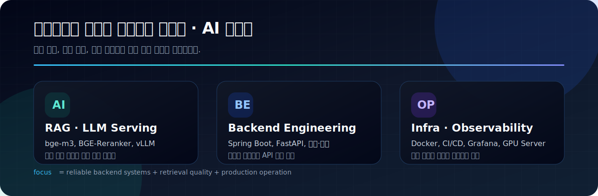
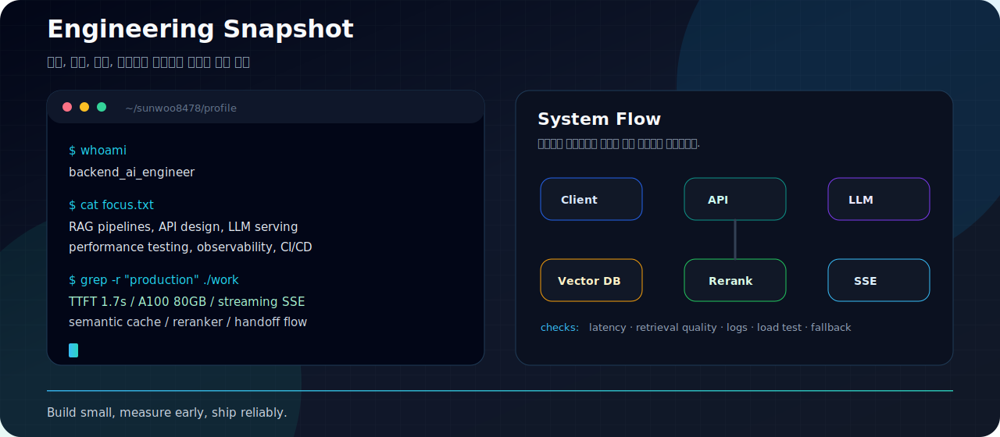
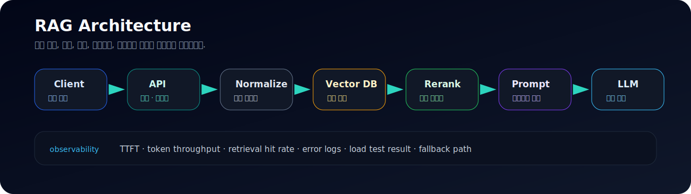

---

---

---

---

## 지금 만드는 것

- **서울노동권익센터 AI 챗봇** 개발 및 KT Cloud A100 서버 부하 테스트
- Gemma 3 12B (vLLM) + RAG 파이프라인 성능 최적화
- RAG 검색 품질, TTFT, 스트리밍 응답, GPU 서버 운영 안정성 개선

---

## 작업 기준

| 단계 | 기준 |
| --- | --- |
| Problem | 사용자가 실제로 막히는 지점과 업무 흐름을 먼저 확인합니다. |
| Design | 도메인 모델, API 계약, 데이터 흐름을 구현 전에 정리합니다. |
| Build | Spring Boot, FastAPI, React 기반으로 작게 만들고 빠르게 검증합니다. |
| Measure | 검색 품질, TTFT, 처리량, 오류 로그를 숫자로 확인합니다. |
| Operate | 배포 이후 로그, 지표, 장애 가능성까지 보고 마무리합니다. |

| 체크포인트 | 보는 것 |
| --- | --- |
| API | 요청/응답 구조가 명확한가, 예외 응답이 일관적인가 |
| Search | 검색 실패 케이스를 수집하고 개선 가능한 구조인가 |
| LLM Serving | TTFT, 토큰 생성 속도, 동시 요청 처리량을 측정하는가 |
| Data | 인덱스, 트랜잭션, 마이그레이션 전략이 정리되어 있는가 |
| Ops | 로그와 지표로 문제 위치를 좁힐 수 있는가 |

## 시스템 설계 메모

## 대표 프로젝트

### 서울노동권익센터 AI 노무상담 챗봇 (비공개)

서울특별시 노동자 종합지원센터에 도입할 AI 법률 상담 챗봇 서비스.

- Gemma 3 12B (vLLM) + bge-m3 임베딩 + BGE-Reranker RAG 파이프라인
- A100 80GB GPU 서버 배포, 동접자 30명 부하 테스트 (TTFT 1.7초)
- 시맨틱 캐시, 스트리밍 SSE, 노무사 연계(Handoff), 관리자 포털
- Spring Boot 3 · React 18 · MariaDB · vLLM · Ollama

---

### [한국어 지식 기반 RAG 어시스턴트](https://github.com/sunwoo8478/korean-chatbot)

한국어 공공데이터를 검색하고 근거 기반 답변을 제공하는 RAG 서비스.

---

### [PayFit ERP](https://github.com/sunwoo8478/ERP)

직원·근태·급여 계산·법정 공제·명세서 업무를 연결한 HR 시스템.

---

## 기술 스택

### Stack Icons

 

 

## 현재 관심사

- RAG 답변 품질 평가와 검색 실패 케이스 개선
- vLLM 기반 LLM 서빙 성능 튜닝
- Spring Boot 기반 업무 시스템의 도메인 설계
- 운영 환경에서의 로그, 지표, 부하 테스트 자동화

---

## GitHub 활동

### 기여 그래프

<picture>
  <source media="(prefers-color-scheme: dark)" srcset="https://raw.githubusercontent.com/sunwoo8478/sunwoo8478/output/snake-dark.svg">
  <source media="(prefers-color-scheme: light)" srcset="https://raw.githubusercontent.com/sunwoo8478/sunwoo8478/output/snake.svg">
  
</picture>

